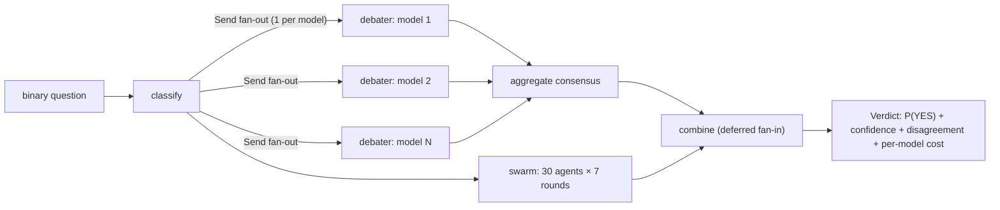

# llm-debate-swarm

[](https://github.com/Lyasuk/llm-debate-swarm/actions/workflows/ci.yml)
[](pyproject.toml)
[](LICENSE)

**A multi-LLM debate & arbitration engine for calibrated binary forecasts.** Give
it a yes/no question; it runs a weighted **multi-provider LLM consensus** and an
**N-agent, multi-round debiasing debate swarm**, then fuses them with robust
statistics into a single **calibrated probability** with a confidence and an
explicit cross-method **disagreement** signal.

Its point of pride isn't the swarm — it's that **the quality is measured, not
asserted** (rigorous calibration eval), **every LLM call is observable** (per-call
OpenTelemetry spans, exportable to Langfuse *and* LangSmith), and the orchestration
is an explicit, resumable **LangGraph** state machine.

> This is an AI-engineering / reliability showcase — a *reasoning engine*, not a
> trading bot. It emits a probability; it never moves money. Design rationale:
> [`DESIGN_DOC.md`](DESIGN_DOC.md) · decisions: [`docs/adr/`](docs/adr/).

---

## How it works (plain language)

The thing deciding *what runs next* is **code**, not a model — so this is a
**workflow / orchestrated multi-agent system**, not an "autonomous agent". The
LLMs live only inside the debater and swarm nodes; the graph owns all the control
flow (how many debaters to fan out, when to aggregate, how to fuse). The word
"agent" in this repo means a debater persona (node content), never a thing that
picks the next step. (Grep the docs: "agent" only appears where a model is node
content — a deliberate discipline.)

- **Consensus** = ask N provider models the same question in parallel, weight-average
  their probabilities, and surface the spread as a confidence.
- **Swarm** = 30 agents debate over 7 rounds (blind → debate → pre-mortem), with
  devil's-advocate injection and groupthink detection, fused by a robust trimmed-mean.
- **Combine** = deterministic fusion into one probability + a disagreement signal.

## Architecture



## Evaluation — measured, with confidence intervals

A reproducible harness scores the engine over **50 real resolved binary questions**
(public prediction-market questions, [`eval/questions.yaml`](eval/questions.yaml))
using **proper scoring rules**: Brier score with a bootstrap 95% CI, log-loss,
**ECE**, a reliability curve, and a Brier **skill score** vs baselines.

| Predictor | Brier ↓ | 95% CI | ECE ↓ | Skill vs base-rate |
|---|---|---|---|---|
| Base-rate baseline (0.36) | 0.230 | — | — | 0.000 |
| Single model (Claude Haiku)\* | 0.246 | — | — | −0.07 |
| **Multi-model consensus** | **0.223** | **[0.183, 0.264]** | 0.106 | **+0.032** |

**Read this honestly.** The consensus's 95% CI **[0.183, 0.264] overlaps** the
base-rate Brier (0.230), so at n=50 the improvement is **not statistically
significant** — "consensus beats base-rate" is *not* a claim this data supports yet.
And ECE 0.106 with a forecast range that never exceeds ~0.585 says the engine is
**under-confident** (regresses toward the middle). Full diagnosis and fixes:
[`POSTMORTEM.md`](POSTMORTEM.md) and [`eval/results/error_analysis.md`](eval/results/error_analysis.md).

\* Single-model and the 30-agent swarm baselines need fresh paid calls; they are
re-confirmed in a live run (tracked as pending in `eval/analyze.py`), not faked.


Reproduce — **no API keys needed** (recomputed from committed predictions):

```bash
python -m eval.analyze          # Brier+CI, log-loss+CI, ECE, skill vs base-rate
python -m eval.error_analysis   # bucket the worst calls, name the dominant failure
```

A **CI regression gate** ([`tests/test_eval_regression.py`](tests/test_eval_regression.py))
fails the build if a change regresses the committed calibration past a data-calibrated
ceiling — and proves it bites on a deliberately-degraded predictor.

## When a debate swarm is the WRONG tool

A full combined forecast is **~210 LLM calls** (30 agents × 7 rounds) + 3 consensus
calls, vs **1** for a single-model baseline — ~2 orders of magnitude more cost and
latency. The falsifiable bet is that debate earns that by better *calibration*, and
**we have not shown it does at n=50**. So: for high-volume or latency-sensitive use,
prefer the single-model or market-price baseline; reserve the swarm for low-volume,
decision-heavy, offline questions. Cost levers (before reaching for the swarm):

| Lever | Effect | Cost impact |
|---|---|---|
| Single strong-model call | the baseline to beat | 1× |
| Multi-model consensus (3 calls) | cancels per-model bias | ~3× |
| Prompt caching (shared rubric prefix) | 30 agents share a large static prefix | big multiplier off |
| Full 30-agent × 7-round swarm | debiasing structure | ~200× |

See [`DESIGN_DOC.md`](DESIGN_DOC.md) §7 for the economic breaking point.

## Observability — one instrumentation, two dashboards

Every LLM call is an OpenTelemetry span using the **GenAI semantic conventions**
(`gen_ai.request.model`, `gen_ai.usage.input_tokens/output_tokens`) plus cost,
latency, and domain attributes (role, question id, persona, debate round). The same
spans fan out **in-process** to **Langfuse** (self-host, privacy) *and* **LangSmith**
(managed, native LangGraph UI) — write instrumentation once, route it anywhere:

```bash
pip install 'llm-debate-swarm[otlp]'
# Langfuse (self-host): set LANGFUSE_HOST / LANGFUSE_PUBLIC_KEY / LANGFUSE_SECRET_KEY
# LangSmith:            set LANGSMITH_API_KEY  (+ optional LANGSMITH_PROJECT)
# any OTLP collector:   set OTEL_EXPORTER_OTLP_ENDPOINT
python trace_demo.py "Will X happen by Y?"
```


*A captured consensus trace — one look shows which model was the latency bottleneck
and what each call cost. (Per-call token/cost/gen_ai attributes are refreshed on the
next live run.)*

## LangGraph — the primary orchestration

The CLI runs the **LangGraph `StateGraph` by default** (`--engine graph`). It's
idiomatic, not decorative: a conditional edge does a **`Send` fan-out** (one debater
per model, count decided at runtime), a **reducer** merges the parallel debaters
(without it the branches would clobber each other — the classic fan-out bug), and
`defer`red fan-in fuses them. It reuses the exact async node bodies (`_query_model`,
`_build_consensus`, `combine_verdict`) — one implementation, two surfaces.

```python
from langgraph.checkpoint.memory import InMemorySaver
from llm_debate_swarm.graph import build_forecast_graph

graph = build_forecast_graph(checkpointer=InMemorySaver())
# Kill the process mid-run, re-invoke with the same thread_id -> resumes from the
# last checkpoint without re-querying completed debaters (proven in tests). For
# production persistence swap in SqliteSaver / PostgresSaver
# (pip install langgraph-checkpoint-sqlite / langgraph-checkpoint-postgres).
```

Budgets are enforced at invoke time (per-run timeout + `recursion_limit`). Built on
`langgraph>=1.2`; deliberately **not** `create_react_agent` (deprecated) — we need
custom deterministic control flow. Rationale: [ADR-0001](docs/adr/0001-langgraph-as-primary-orchestrator.md).

## Security

The question, resolution text, and any fetched evidence are **untrusted** (indirect
prompt-injection surface). Defenses: structural input **isolation** (`wrap_untrusted`),
a heuristic injection tripwire, a deterministic output guardrail (probability ∈ [0,1]),
and the ensemble itself (hijacking 1 of N models barely moves a robust aggregate). A
first-class **red-team eval** ([`eval/redteam.py`](eval/redteam.py)) exercises it.
Threat model + OWASP-LLM/ASI mapping: [`SECURITY.md`](SECURITY.md).

## Quickstart

```bash
git clone https://github.com/Lyasuk/llm-debate-swarm && cd llm-debate-swarm
python -m venv .venv && source .venv/bin/activate
pip install -e ".[dev,graph,otlp]"
cp .env.example .env          # add at least one provider API key

debate-swarm forecast "Will global average CO2 exceed 430 ppm before 2030?"
debate-swarm forecast "Lakers vs Celtics — will the Lakers win?" --no-swarm
debate-swarm forecast "..." --engine async   # raw asyncio path instead of the graph
```

Every stage degrades gracefully: disable a stage, or run with whatever provider keys
you have — missing providers are skipped, not fatal. `config.yaml` controls the model
panel and swarm parameters.

## Tests & CI

```bash
pytest            # 46 tests — no network/keys required
ruff check .      # lint
```

CI ([`.github/workflows/ci.yml`](.github/workflows/ci.yml)) runs ruff + the full
suite (incl. the eval-regression gate) on Python 3.11 and 3.12. Exact environment
pinned in [`requirements.lock.txt`](requirements.lock.txt).

## Design docs

[`DESIGN_DOC.md`](DESIGN_DOC.md) · [`docs/adr/`](docs/adr/) (decision records) ·
[`SECURITY.md`](SECURITY.md) (threat model) · [`POSTMORTEM.md`](POSTMORTEM.md)
(a real calibration failure, blameless).

## License

MIT — see [LICENSE](LICENSE).
