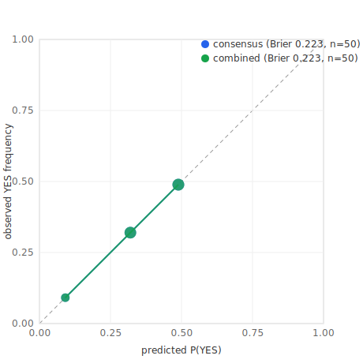
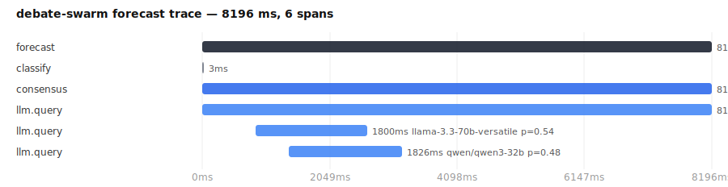

# llm-debate-swarm

**A multi-LLM debate & arbitration engine.** Give it a binary question; it runs a
weighted **multi-provider LLM consensus** *and* an **N-agent, multi-round debiasing
debate swarm** in parallel, then aggregates them with robust statistics into a single
**calibrated probability** with confidence and an explicit cross-method **disagreement**
signal.

Built as async Python, provider-agnostic (Anthropic · OpenAI · Google · Groq), with
per-call cost tracking and an optional SQLite audit of every model and agent.

> This repo is the domain-neutral core extracted from a private probabilistic-forecasting
> engine. The trading/exchange layer that consumed these probabilities is intentionally
> **not** included — this is the reasoning engine, not a trading bot.

---

## Why it exists

Single-model self-evaluation shares the model's own blind spots. Asking three models and
averaging barely helps — they anchor on each other and on whatever number they see first.
This engine attacks that directly:

- **Independence first.** Agents produce *blind* estimates before seeing any anchor
  (market price, peers' answers, or the question's framing).
- **Structured debiasing.** A 7-round protocol: blind → debate (blind, then anchor-aware)
  → **pre-mortem** ("assume your estimate was wrong — what did you miss?") → meta-synthesis.
- **Adversarial pressure.** A configurable set of agents argue the *devil's-advocate* side.
- **Groupthink detection.** If the swarm collapses to too few distinct estimates, the round
  is re-run at higher temperature to restore diversity.
- **Robust aggregation.** Trimmed mean + MAD outlier rejection, with anchoring-shift and
  convergence metrics surfaced so you can see *how* the answer was reached, not just the number.

The multi-provider consensus and the swarm are computed independently; their **disagreement**
is a first-class output — high disagreement is a signal, not noise.

## Architecture

```
question
  ├─ classify (rule-based question typing: barrier / deadline / fixed-date / head-to-head)
  ├─ (optional) web research  ──────────────► research document
  │
  ├─ PARALLEL ─┬─ multi-LLM weighted consensus   (N providers, weighted, structured JSON)
  │            └─ debate swarm                    (M agents × 7 debiasing rounds)
  │                 ├─ blind rounds (anti-anchoring)
  │                 ├─ debate rounds (blind, then anchor-aware)
  │                 ├─ devil's-advocate agents
  │                 ├─ pre-mortem round
  │                 ├─ groupthink detection + retry
  │                 └─ robust aggregation (trimmed mean, MAD, anchoring/convergence)
  │
  └─ combine ─► Verdict { probability, confidence, consensus_p, swarm_p,
                          disagreement, anchoring_shift, convergence, cost, per_model }
```

## Quickstart

```bash
git clone https://github.com/Lyasuk/llm-debate-swarm
cd llm-debate-swarm
python -m venv .venv && source .venv/bin/activate
pip install -e ".[dev]"
cp .env.example .env          # add at least one provider API key

debate-swarm forecast "Will global average CO2 exceed 430 ppm before 2030?"
debate-swarm forecast "Lakers vs Celtics — will the Lakers win?" --no-swarm
```

Programmatic use:

```python
import asyncio
from llm_debate_swarm import DebateSwarmEngine

async def main():
    engine = DebateSwarmEngine(use_swarm=True)
    v = await engine.forecast("Will SpaceX reach orbit with Starship by Q4?", horizon_days=120)
    print(f"{v.probability:.1%}  (consensus={v.consensus_probability}, "
          f"swarm={v.swarm_probability}, disagreement={v.disagreement:.1%})")

asyncio.run(main())
```

Every stage is optional and degrades gracefully: disable either stage, or run with whatever
provider keys you have — missing providers are skipped, not fatal.

## Configuration

`config.yaml` controls the consensus model panel (names, providers, weights) and the swarm
(agent count, rounds, devil's-advocate count, trimming, bucketed model routing). See the
file for inline docs.

## Tests

```bash
pytest            # unit tests (types, classifier, import graph) — no network/keys required
```

## Evaluation

A reproducible calibration harness scores the engine over **50 real resolved binary
questions** (public prediction-market questions — see [`eval/questions.yaml`](eval/questions.yaml)).
For each question the engine outputs a P(YES); we score it against the known outcome
with the **Brier score** (lower = better), log-loss, and a reliability curve.

| Configuration | Brier&nbsp;↓ | vs. base-rate (0.230) | log-loss |
|---|---|---|---|
| Single model (Claude Haiku) | 0.246 | worse | 0.733 |
| **Multi-model consensus** (Haiku + Llama&#8209;3.3&#8209;70B + Qwen3&#8209;32B) | **0.223** | **better** | 0.629 |

**The multi-model consensus is better-calibrated than any single model and beats the
base-rate baseline** — the weighted ensemble cancels individual models' biases.



Reproduce:

```bash
python eval/fetch_questions.py              # refresh ground truth from the public API
python -m eval.run_eval --config consensus  # score the consensus over all questions
python eval/plot_calibration.py             # render the reliability diagram (SVG)
```

**Honest caveats** (this is a calibration demo, not a trading claim):

- n&nbsp;=&nbsp;50, resolved Jan–Jun 2026. Some questions may predate model training cutoffs
  (leakage) — but every configuration sees the same set, so the *relative* comparison is
  leakage-robust.
- The **debate-swarm vs. consensus** comparison is wired (`--config combined`) but not run
  in these numbers: the 30-agent swarm exceeds free-tier token budgets. Run it with adequate
  provider quota to add the swarm column.

## Observability

Every forecast is instrumented with **OpenTelemetry**. A run emits a span tree —
`forecast → classify → consensus → llm.query` (one span per model) and `→ swarm` —
carrying latency, the probability each model returned, cost, and errors as span
attributes. Instrumentation is a no-op until enabled, so it never affects normal runs.



*Real captured trace of a consensus forecast: Claude Haiku (8.2&nbsp;s) was the latency
bottleneck; the two Groq models returned in ~1.8&nbsp;s; per-model probabilities
(0.32 / 0.54 / 0.49) fused to a 0.43 consensus. One look tells you where time went.*

Capture a trace yourself:

```bash
python trace_demo.py "Will X happen by Y?"      # writes docs/sample_trace.{json,svg}
```

Stream the **same spans** to a real backend — no code change — by pointing OTLP at it:

```bash
pip install 'llm-debate-swarm[otlp]'
export OTEL_EXPORTER_OTLP_ENDPOINT=https://cloud.langfuse.com/api/public/otel  # or Jaeger / Tempo
python trace_demo.py "Will X happen by Y?"
```

## LangGraph orchestration

The same pipeline is also exposed as an explicit **LangGraph** `StateGraph` — classify,
fan out to the consensus and the swarm in parallel, fan in to combine — reusing the very
same engine components (`combine_verdict`, the analyzer, the swarm), so no logic is
duplicated. Use it if your stack is standardized on LangGraph:

```bash
pip install 'llm-debate-swarm[graph]'
```

```python
from llm_debate_swarm.graph import forecast_with_graph

verdict = await forecast_with_graph("Will X happen by Y?", use_swarm=False)
```

```text
          ┌─> consensus ─┐
  classify               ├─> combine
          └─> swarm ──────┘
```

## Roadmap

- [x] **Evaluation harness** — reproducible Brier + calibration over 50 resolved questions (see [Evaluation](#evaluation)).
- [x] **Observability** — OpenTelemetry spans, exportable to Langfuse / Jaeger via OTLP (see [Observability](#observability)).
- [x] **LangGraph** orchestration surface — `StateGraph` fan-out/fan-in (see [LangGraph orchestration](#langgraph-orchestration)).
- [ ] FastAPI service + Dockerfile.

## License

MIT — see [LICENSE](LICENSE).
